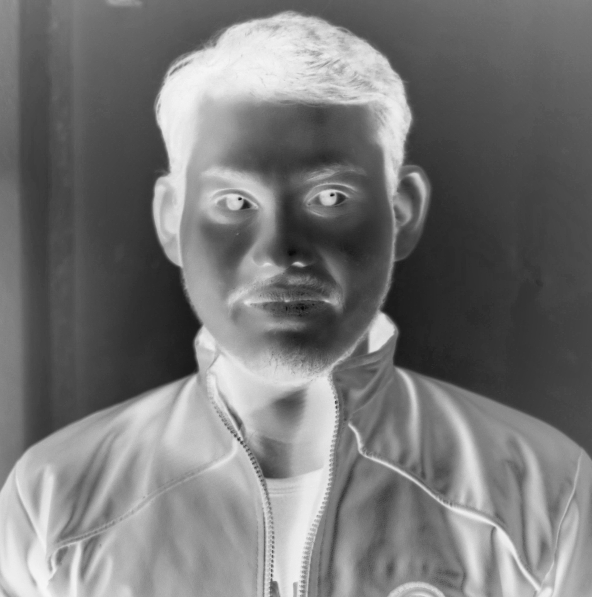

# NumPy Image Operations – My Learnings

This repository contains my personal experiments with **NumPy for image matrix operations**.  
It demonstrates converting images to grayscale, brightening, and inverting using NumPy array operations.

All code is provided in a Jupyter Notebook, with processed outputs saved in the `results/` folder for reference.

## Sample Outputs

| Grayscale | Brightened (NumPy + clip) | Brightened (cv2.convertScaleAbs) | Inverted |
|-----------|---------------------------|---------------------------------|----------|
|  |  |  |  |

### 📌 Notes

- Images as matrices: Each pixel is represented as [B, G, R] values (0–255). Grayscale images have a single channel.

- Brightness adjustment:

  - NumPy + clip: np.clip(gray + 50, 0, 255) → simple addition, may cause blocky blacks in very dark regions

  - OpenCV convertScaleAbs: cv2.convertScaleAbs(gray, alpha=1, beta=50) → safer, smooth output

- Inversion: 255 - gray flips pixel intensity values.